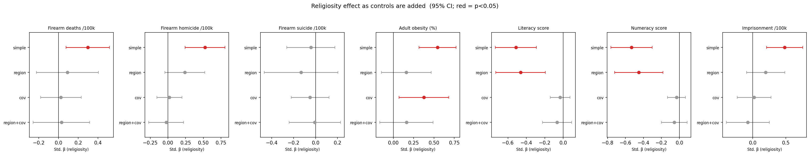
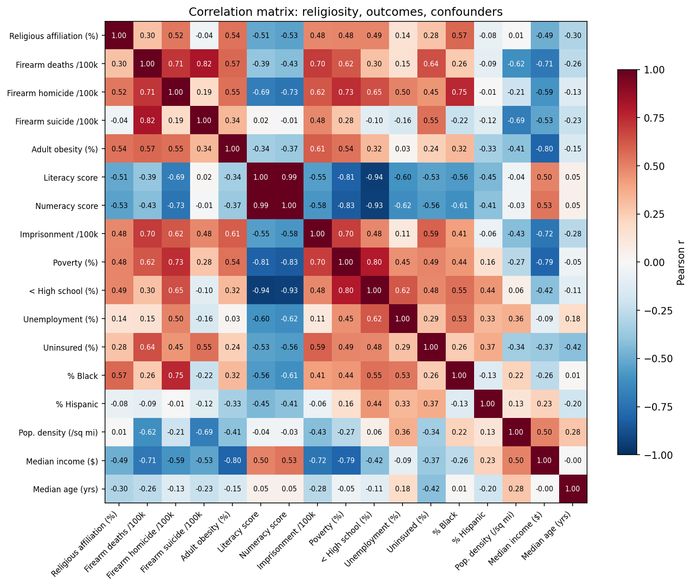
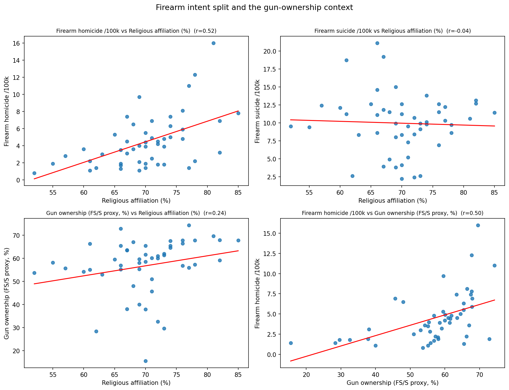

# U.S. Religiosity and State-Level Social Outcomes


A small, reproducible data-science project that tests a popular state-level claim:

> *More religious U.S. states have higher rates of gun violence, illiteracy, obesity, and incarceration.*

It extracts public data, builds one clean row per state, and works up from simple correlations to **covariate-adjusted, hierarchical, and Bayesian models**. The point throughout is **association, not causation** — and the headline result is a case study in why that distinction matters.

---

## TL;DR — what the data says

**As a description of states, the claim holds. As a claim about religion itself, it mostly doesn't.**

- Every bivariate association runs in the predicted direction and is statistically robust (survives FDR correction; every bootstrap 95% CI excludes zero).
- But religiosity is tightly bound to disadvantage — more religious states are poorer, less educated, and demographically different (r with % Black = 0.57, poverty = 0.49, low-education = 0.49).
- **Adjusting for region** removes the firearm, obesity, and imprisonment associations. **Adjusting further for socioeconomics** removes essentially everything else — *including literacy and numeracy*, which had survived the region-only adjustment.
- The "gun violence" signal is specifically firearm **homicide** (r = +0.53), not suicide (r = −0.04) — and even that is fully explained by socioeconomics, not by gun ownership.
- A `MixedLM` and a **PyMC Bayesian** multilevel model agree: after full adjustment, **no** outcome has a religiosity coefficient whose 94% credible interval excludes zero. Obesity was the last holdout, but it too disappears once **median income and median age** are added to the controls.

Standardised religiosity coefficient (β, in SD units) as controls are added — it collapses toward zero everywhere:

| Outcome | simple | + region | + covariates | + region & cov |
|---|---:|---:|---:|---:|
| Firearm deaths (total) | 0.30\* | 0.09 | −0.11 | −0.10 |
| Firearm **homicide** | 0.53\* | 0.24 | −0.08 | −0.09 |
| Firearm **suicide** | −0.04 | −0.13 | −0.15 | −0.14 |
| Adult obesity | 0.54\* | 0.16 | 0.07 | 0.01 |
| Literacy | −0.51\* | −0.46\* | −0.02 | −0.04 |
| Numeracy | −0.53\* | −0.45\* | −0.00 | −0.02 |
| Imprisonment | 0.48\* | 0.20 | −0.10 | −0.14 |

<sub>\* p < 0.05. Full tables in [`reports/tables/`](reports/tables/).</sub>



---

## The pipeline

Three notebooks, run in order. They are deliberately notebooks, not a package, so each step is readable and inspectable.

| # | Notebook | What it does |
|---|----------|--------------|
| 1 | [`notebooks/01_extract_public_data.ipynb`](notebooks/01_extract_public_data.ipynb) | Downloads/scrapes the raw public data into `data/raw/`. Defensive fetching with retries and cached fallbacks. |
| 2 | [`notebooks/02_transform_state_panel.ipynb`](notebooks/02_transform_state_panel.ipynb) | Cleans, standardises state names, validates, and merges everything into one row per state → `data/processed/state_religiosity_outcomes.csv`. |
| 3 | [`notebooks/03_analyse_religiosity_outcomes.ipynb`](notebooks/03_analyse_religiosity_outcomes.ipynb) | The analysis (see below). Exports tables/figures to `reports/`. |

**Notebook 03, Part 1 (descriptive):** missingness, Pearson/Spearman correlations, scatter plots, simple OLS, region-adjusted OLS.

**Notebook 03, Part 2 (deeper analysis):** distributions, a full correlation heatmap, regional boxplots, region-coloured scatters, religiosity-vs-confounder checks, **covariate-adjusted regressions**, a model-comparison forest plot, partial correlations, FDR multiple-comparison control, bootstrap CIs, influence diagnostics, the **firearm homicide-vs-suicide split** with a gun-ownership analysis, a **hierarchical `MixedLM` model**, a **Bayesian multilevel model (PyMC)**, and a **robustness check across religiosity measures**.

### Data sources

- **Pew Research Center** Religious Landscape Study state pages (religious affiliation).
- **Pew Research Center** analysis of CDC WONDER firearm mortality (total firearm rate).
- **CDC** adult obesity (BRFSS) CSV.
- **CDC** *Mapping Injury, Overdose, and Violence* (Socrata `fpsi-y8tj`) — firearm deaths split by intent + gun-ownership proxy.
- **Bureau of Justice Statistics** *Prisoners in 2023* (imprisonment rates).
- **NCES / PIAAC** Skills Map via ArcGIS Open Data (literacy, numeracy, and the socioeconomic covariates).
- **U.S. Census** county Gazetteer (land area → population density) and the **ACS 1-year** API (median household income, median age).

## How religiosity is measured

```text
religiously_affiliated_pct = 100 - religiously_unaffiliated_pct
```

The unaffiliated share is extracted from Pew state pages as `Atheist + Agnostic + Nothing in particular`. This is a practical, current, state-level proxy for affiliation — not the same as Pew's older "highly religious" index (belief + prayer + attendance + importance). The analysis is written so another religiosity measure can be swapped in.

## Outcomes

- Firearm mortality per 100,000 (age-adjusted, 2024) — plus **firearm homicide** and **firearm suicide** separately (CDC, 2024).
- Adult obesity prevalence (2024).
- Literacy and **numeracy** average scores (PIAAC/NCES).
- Imprisonment rate per 100,000 residents (2023).

## Covariates (confounders)

Carried in the panel and used by the Part 2 models to test whether religiosity predicts outcomes *independently* of socioeconomics:

- Poverty, less-than-high-school share, unemployment, uninsured share, SNAP, % Black, % Hispanic (PIAAC/NCES).
- A household **gun-ownership proxy** (FS/S = firearm suicides ÷ all suicides; CDC).
- **Population density** (population ÷ Census land area) as an urbanicity proxy.
- **Median household income** and **median age** (Census ACS 1-year 2023).

## Selected figures

| | |
|---|---|
|  |  |
| Correlation matrix of religiosity, outcomes, and confounders | The firearm total hides a homicide-vs-suicide story |

All figures live in [`reports/figures/`](reports/figures/) and all result tables in [`reports/tables/`](reports/tables/).

## Setup

```bash
python -m venv .venv
source .venv/bin/activate          # Windows: .venv\Scripts\Activate.ps1
pip install -r requirements.txt
# (equivalently: pip install pandas numpy requests beautifulsoup4 lxml matplotlib
#  scipy statsmodels tqdm pdfplumber nbformat pymc arviz)
```

Then run the three notebooks in order (e.g. `jupyter lab`, or
`jupyter nbconvert --to notebook --execute --inplace notebooks/0*.ipynb`).

### Reproducibility notes

- Notebook 01 talks to several live sources. Each extractor **retries**, then **falls back to a cached CSV** in `data/raw/`, and validates that it ends with exactly 50 states — so the pipeline is reproducible and survives a flaky source.
- The committed `data/` and `reports/` let you read the results without re-running anything.
- Adding median income and median age requires a free [Census API key](https://api.census.gov/data/key_signup.html) in a `CENSUS_API_KEY` environment variable (see roadmap).

## Project structure

```text
.
├── README.md
├── LICENSE
├── requirements.txt
├── docs/
│   └── DATA_DICTIONARY.md   # every panel column: units, range, source
├── notebooks/        # 01 extract · 02 transform · 03 analyse
├── data/
│   ├── raw/          # snapshots from each public source
│   └── processed/    # state_religiosity_outcomes.csv (the analytical panel)
└── reports/
    ├── figures/      # all plots
    └── tables/       # all result tables (correlations, models, bootstrap, …)
```

Every column in the analytical panel is documented in [`docs/DATA_DICTIONARY.md`](docs/DATA_DICTIONARY.md).

## Interpretation & caveats

- **Ecological fallacy.** These are 50-state correlations. They say nothing about whether religious *individuals* are more violent, less literate, more obese, or more likely to be incarcerated.
- **Confounding is the whole story.** The headline associations are fully explained by region and socioeconomics. The covariate set is now fairly rich (poverty, education, income, age, race, density), though it still omits a direct gun-ownership survey and policy variables.
- **Measurement.** Religiosity is proxied by current affiliation; "illiteracy" by an average PIAAC score; gun ownership by the FS/S proxy.
- **Small n.** With 50 observations and many correlated predictors, estimates are noisy and standard errors inflate in the fullest models.

## Roadmap

### ✅ Done

- Reproducible three-stage pipeline (extract → transform → analyse) with retries and cached fallbacks.
- Descriptive layer: Pearson/Spearman correlations, scatter plots, simple and region-adjusted OLS.
- Socioeconomic covariates: poverty, education, unemployment, insurance, SNAP, % Black, % Hispanic, density, **median income**, **median age**.
- Firearm deaths split into **homicide vs suicide** + an FS/S **gun-ownership proxy**.
- Covariate-adjusted regressions, partial correlations, FDR control, bootstrap CIs, influence diagnostics.
- **Hierarchical** `MixedLM` and **Bayesian** (`PyMC`) multilevel models.
- **Robustness** across religiosity operationalisations (affiliated / atheist / agnostic / "nothing in particular").
- **Diagnostics & sensitivity** (Part 3): VIF multicollinearity, religiosity × region interactions, a cross-validated **LASSO** variable-selection check, and a missing-obesity imputation sensitivity test.
- Repo: data dictionary, pinned `requirements.txt`, MIT license.

### 🔜 Refinements (no new data needed — open to PRs)

- Spatial autocorrelation diagnostics (e.g. Moran's I on residuals).
- Alternative penalties (ridge / elastic-net) and outcome transformations.

### ⛔ Blocked on external data (drop the file in `data/raw/` and it can be wired up)

- A religious **practice-intensity** measure (attendance / prayer / importance). Pew's pages 403 or render via JS — needs the RLS microdata download.
- **County-level** analysis. Needs a county religiosity source (ARDA / U.S. Religion Census, manual download); county firearm and covariates are already available from CDC/Census.
- A **direct gun-ownership** series (RAND HFR) and **gun-policy** indices — RAND's file is access-gated.

---

<sub>Built as an exercise in careful, honest ecological analysis. Data are public; see each extractor in notebook 01 for exact source URLs.</sub>
